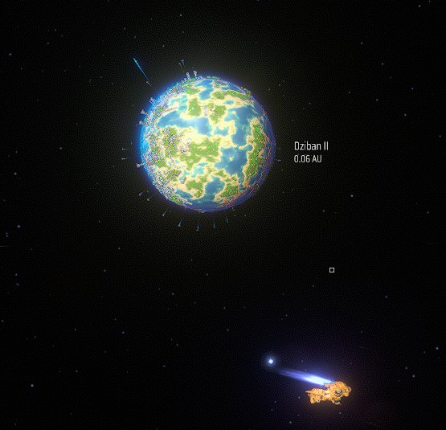
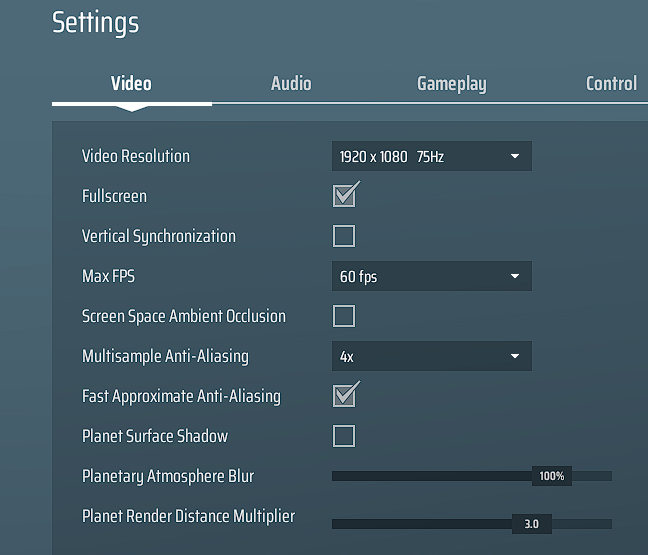

# Render Distance

This is a small mod that lets you change the distance to a planet at which its assets get rendered. 
It will also allow you to view remote planets in the current solar system in Planet View mode.

## remote Planet View mode

## Render distance
  

## Changelog
### 0.5.0
- initial release
- included the Render Distance slider in settings and its functionality

### 0.6.0
- changed positioning code for slider in settings
- increased max render distance to 10.0
- render priority of gas planets is the lowest now.
- added a feature to view remote planets in Planet View mode
- <b>known bug:</b> viewing remote planets may change icarus size a little bit.

### 0.6.1
- fixed a bug that would teleport the player to a remote planet. (thanks to cdeath-zz for finding and reporting it)

### 0.6.2
- fixed a bug that prevented Planet View mode on remote planets while in space (thanks to cdeath-zz and GreyHak for reporting it)
- fixed a visual bug in the settings (thanks to Taki7o7 for reporting this to me)

### 0.6.3
- fixed the debug message spam, sorry!

### 0.6.4
- fixed a bug that would teleport you next to the sun when opening planet view "the normal way" and then pressing esc. (thanks to Nordblum for reporting and testing)

### 0.6.5
- fixed a bug that would teleport you to a remote planet when opening planet view mode on a remote planet repeatedly while in space.
- prevent remote planet view mode when construction drones are still working. (thanks to cdeath-zz for reporting)

### 0.6.6
- fixed a bug that would increase or decrease icarus size after returning from remote planet view mode. (Thanks GreyHak and Nordblum)

### 0.6.7
- fixed a bug that produced an error when you were in remote planet view while mining something by hand. (thanks cdeath-zz for reporting and testing)

### 0.6.8
- added a config option to make the render distance settings slider persistent.
- fixed a bug that produced an error when you were in remote planet view while mining something by hand or walking somewhere (thanks again to cdeath-zz)
- fixed some random teleportation bugs and breaking out of sailing mode bugs

### 0.6.9
- fixed some bugs that prevented you from using "remote planet view" on planets in other star systems (thanks to wingless and Nordblum for reporting this to me)
